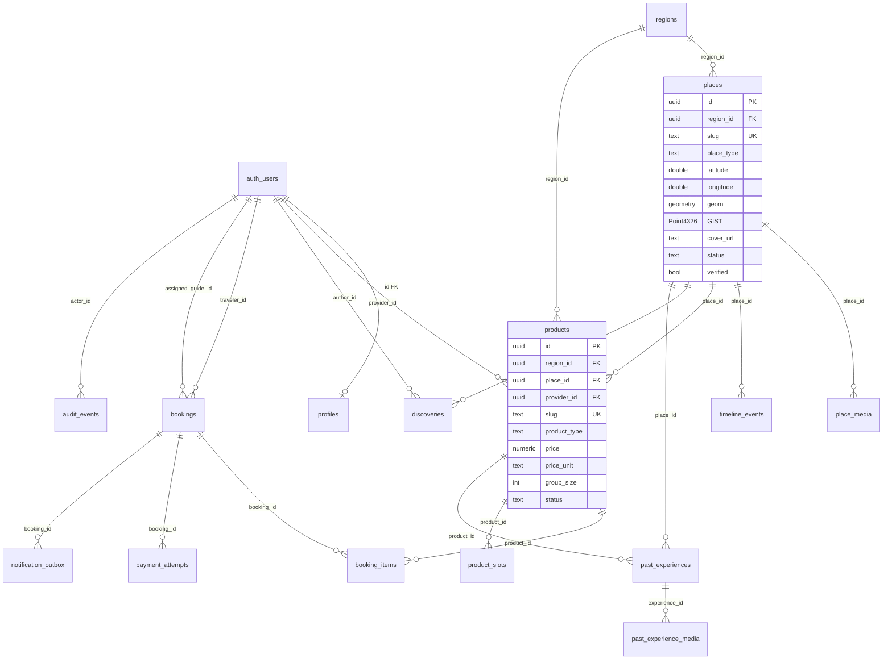
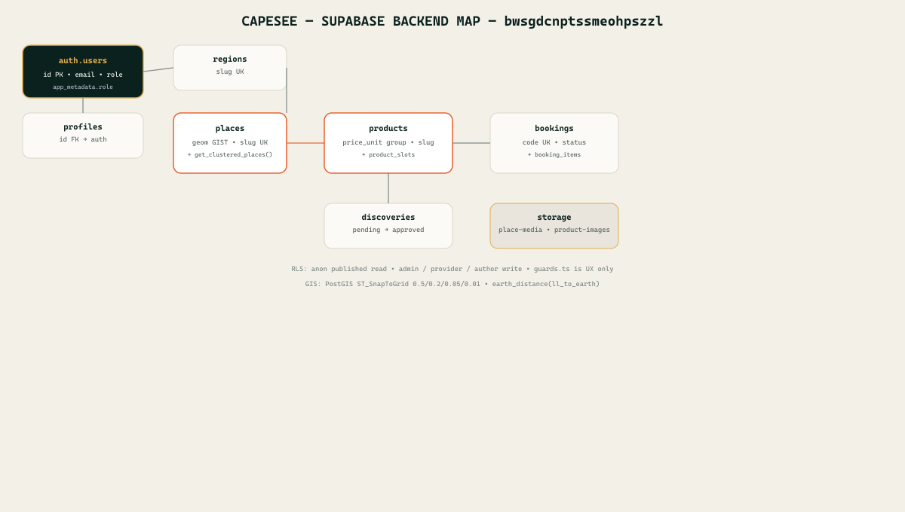

# Capesee Backend — Supabase `bwsgdcnptssmeohpszzl`

> Source `supabase/migrations/*` → `Vercel` env `VITE_SUPABASE_URL` + `VITE_SUPABASE_PUBLISHABLE_KEY` → `src/services/supabase/*`

## 1) Topology

```
[React Vite + TanStack Router] ──REST/RPC──> [Supabase Postgres 15 + PostGIS + Storage]
  ├─ auth.users (JWT app_metadata.role) ──> profiles ──> RLS
  ├─ public.* (9 core tables + 2 GIS) ──> GIST indexes
  ├─ storage buckets: place-media / product-images (public)
  └─ edge functions: paynow-create / paynow-webhook / notifications-dispatch
```

---

## 2) ER Diagram





---

## 3) Tables + RLS Matrix

| Table | PK | Key cols | RLS read | RLS write | Frontend |
|-------|----|----------|----------|-----------|----------|
| `profiles` | `id→auth.users` | `full_name,phone` | `own or admin` | `own insert/update` | `auth.ts:29 hydrateProfile` |
| `regions` | `id` | `slug UK, status` | `published` anon | `admin all` | `places.ts:55` `regions!inner` |
| `places` | `id` | `slug UK, type, lat/lng, geom GIST, status` | `published` anon | `admin all` | `PlaceCard.tsx` + `get_clustered_places()` |
| `place_media` | `id` | `place_id, kind, url, status` | `published` anon | `admin all` | `AdminMediaPage.tsx:193` |
| `timeline_events` | `id` | `place_id, event_year, kind` | `published` anon | `admin all` | `PlaceOverview` |
| `products` | `id` | `region_id, slug UK, product_type, price_unit person|night|trip|group, group_size, status` | `published` anon; `provider_id=uid` read | `provider or admin` draft/pending | `TourCard.tsx` `fetchProducts()` |
| `product_slots` | `id` | `product_id, starts_at, capacity` | `authenticated` | `admin/provider` | `AdminInventoryPanel` |
| `discoveries` | `id` | `author_id, place_id, category, status pending|approved` | `approved` anon | `author pending` insert | `journal/create` `moderate_discovery` |
| `bookings` + `booking_items` | `id` | `code UK, status, assigned_guide_id, traveler_details jsonb` | `traveler or guide or admin` | `admin update` | `create_booking` RPC (20260814074111) |
| `payment_attempts` | `id` | `booking_id, provider, amount, status` | `service_role` | `service_role` | `paynow-*` `AdminPaymentsPage` |
| `past_experiences` | `id` | `provider_id, place_id, product_id, status` | `admin` | `admin` | `AdminPastExperienceEditor` |
| `audit_events` | `id` | `actor_id, action, entity_type` | `admin` | `admin` | `AdminSettingsPage` |

---

## 4) GIS Functions

*Migration `20260905120000_postgis_clustering.sql`*

- `places.geom = ST_SetSRID(MakePoint(lng,lat),4326)` + `GIST` + trigger `places_set_geom()`
- `get_clustered_places(min_lat,max_lat,min_lng,max_lng,zoom)` → `ST_SnapToGrid` grid `0.5|0.2|0.05|0.01` → `cluster_count>1` vs singletons
- `nearby_places(lat,lng,radius)` → `earth_distance(ll_to_earth)` `fbf389e` fixed `point <@>` operator

Used in `src/services/maps/cluster.ts:1` + `useClusteredMarkers.ts:1` debounced 300ms.

---

## 5) Storage

*Migration `20260905130000_storage_buckets.sql`*

```sql
buckets: place-media (public true), product-images (public true)
policy Public read: anon select where bucket in (...)
policy Admin upload/update/delete: authenticated where bucket in (...) and (role=admin or uid not null)
```

`uploadPlaceCover()` / `uploadProductCover()` → `storage.from(bucket).upload()` → `getPublicUrl()` → `cover_url`.

---

## 6) Auth

- `auth.users.raw_app_meta_data.role` ∈ `traveler|guide|driver|admin` + hard `ADMIN_EMAILS={'brandontinoz@gmail.com'}` `auth.ts:9`
- `useAuthStore` `capesee-auth-v1` persisted → `guards.ts:25` `requireAdmin()` / `requireGuide()` → redirect `/discover` (RLS is source of truth)
- `hydrateCatalog()` Dexie `CapeseeDB` `offlineDb.ts` cache-first → Supabase sync → `offlineSync.ts` `pending` queue + `NetworkStatus`

---

## 7) Wiring Checklist

- [x] `supabase db push` with `SUPABASE_ACCESS_TOKEN` or paste `supabase/migrations/*.sql` in SQL Editor
- [x] Vercel env `VITE_SUPABASE_URL=https://bwsgdcnptssmeohpszzl.supabase.co` + `VITE_SUPABASE_PUBLISHABLE_KEY=sb_publishable_...`
- [x] Redeploy → `dist` sitemap DB-driven, prerender 9 routes, `sw.js` 344 precached
- [ ] Verify `select * from get_clustered_places(-34.5,-33.2,18.1,19.0,11)` and `nearby_places(-33.9249,18.4241,10000)`
